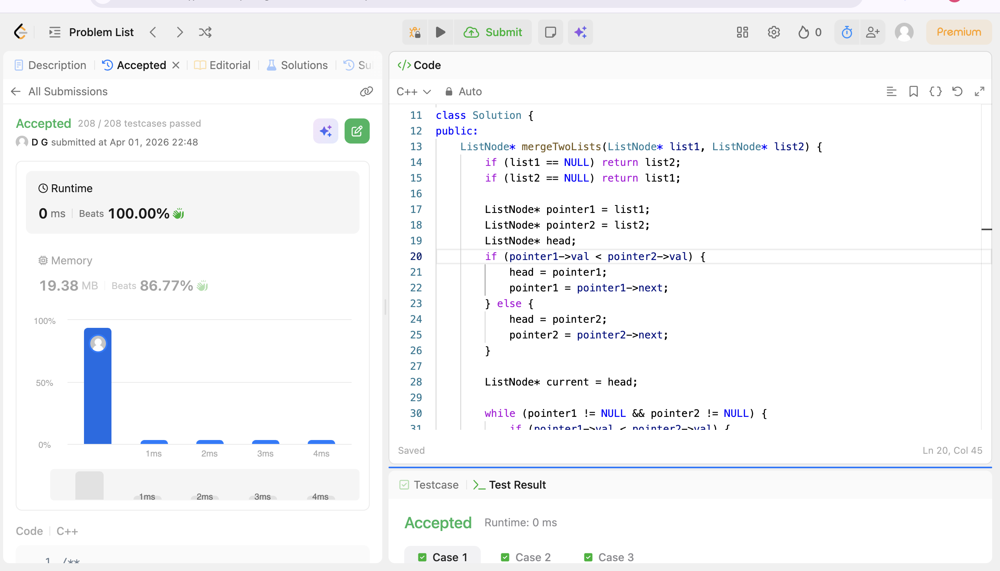

# POTD Day 11 - Merge two sorted linked lists

## Brief Description
Used pointers to compare and link and iterate through the elements.
Couldn't get the whole ss of code so pasting the code-

class Solution {
public:
    ListNode* mergeTwoLists(ListNode* list1, ListNode* list2) {
        if (list1 == NULL) return list2;
        if (list2 == NULL) return list1;

        ListNode* pointer1 = list1;
        ListNode* pointer2 = list2;
        ListNode* head;
        if (pointer1->val < pointer2->val) {
            head = pointer1;
            pointer1 = pointer1->next;
        } else {
            head = pointer2;
            pointer2 = pointer2->next;
        }

        ListNode* current = head;

        while (pointer1 != NULL && pointer2 != NULL) {
            if (pointer1->val < pointer2->val) {
                current->next = pointer1;
                pointer1 = pointer1->next;
            } else {
                current->next = pointer2;
                pointer2 = pointer2->next;
            }
            current = current->next;
        }

        if (pointer1 != NULL) current->next = pointer1;
        else current->next = pointer2;

        return head;
    }
};

## Proof of Acceptance

