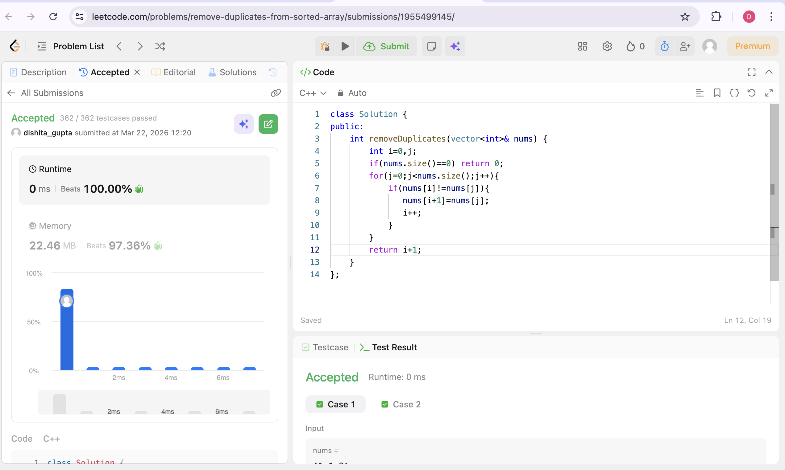

# POTD Day 1 - [Remove Duplicates from sorted arrays]

## Brief Description
I used the two-pointer approach.Initially both the pointers are at the start.I iterated,such that one pointer starts iterating until it finds a different number.Once the number is found,it will get in the (index of the previous pointer+1) and then the previous pointer will be iterated once and gets in one index forward and hence again the second pointer will restart iterating.
## Proof of Acceptance

