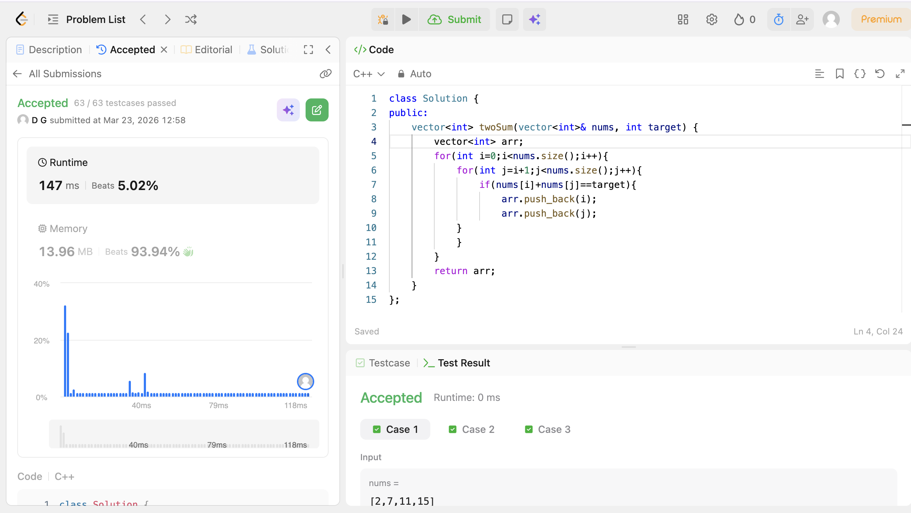

# POTD Day 2 - [Two Sum]

## Brief Description
Iterated i and j such that when the value at their indexes equals the target,they get pushed back into the answer(arr) vector and that is returned as the answer.

## Proof of Acceptance

