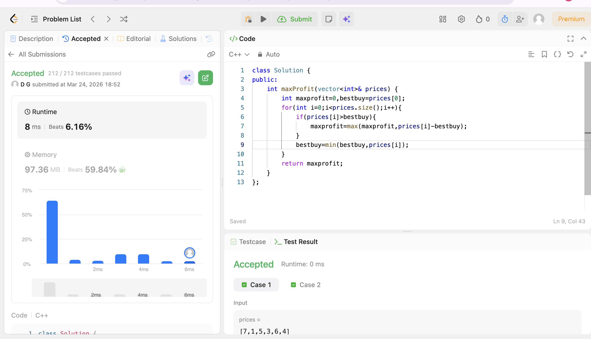

# POTD Day 3 - [Best time to buy and sell stocks]

## Brief Description
Iterated i such that each arr[i] is visualised as a selling day and compared if there is any element lesser than that so that we can subtract to find the profit and kespt track of the max profit.Also compared the element with the best buy day so that we can update the day that is best to buy stocks.
## Proof of Acceptance

