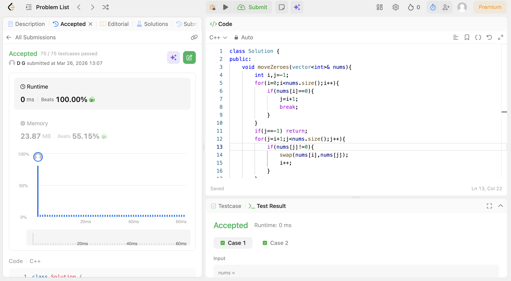

# POTD Day 5 -  Move Zeroes

## Brief Description
 Using the two-pointer approach,iterted i and j such that when found the first 0 at index i,j starts iterting ansd swaps element of i with  non-zero element.
## Proof of Acceptance

