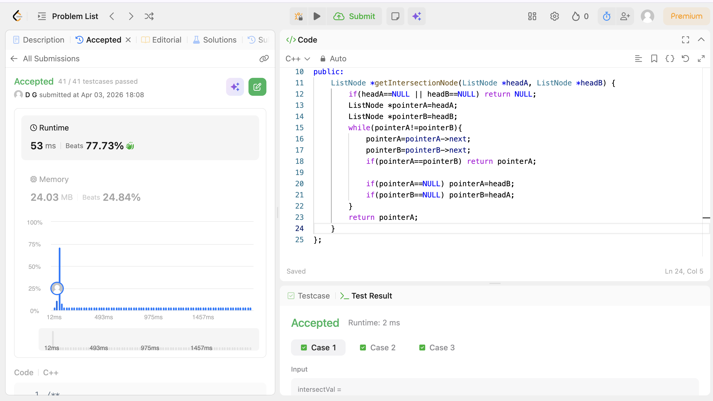

# POTD Day 13 - Intersection of two linked lists

## Brief Description
Iterated the pointers.When one reach null,it starts at the head of the other.When both become same,that's the intersection node otherwise return null.

## Proof of Acceptance

