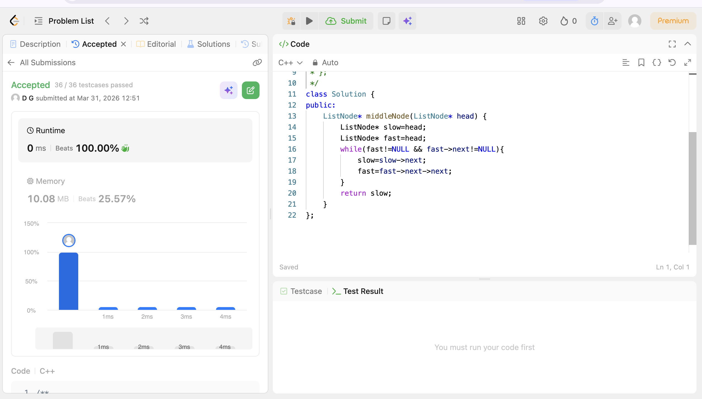

# POTD Day 10 - Middle of the Linked List

## Brief Description
Used two pointers and iterated them as such that the fast pointer runs double the speed of slow pointer so when fast reaches the end,slow reaches the middle.
 

