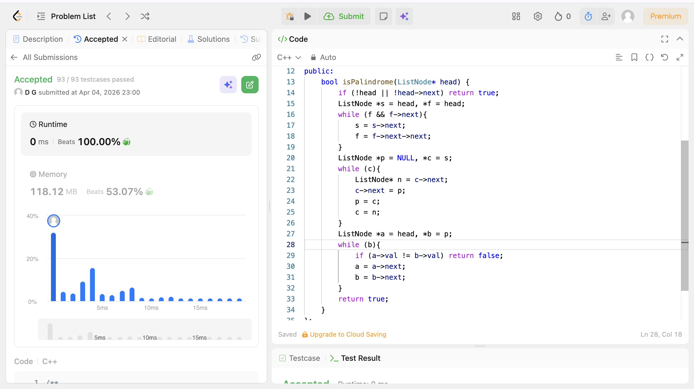

# POTD Day 14 - Palindrome Linked List

## Brief Description
Went to the middle of the list, then flipped the second half backwards.
Compared both halves — if they look the same, it’s a palindrome.

## Proof of Acceptance

