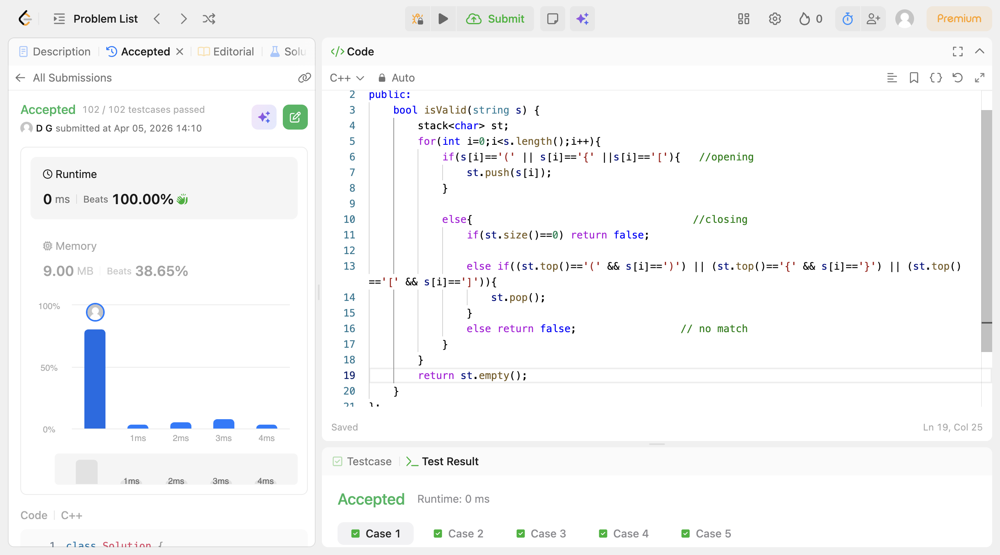

# POTD Day 15 - Valid Parentheses

## Brief Description
Iterated such that if there is an opening bracket it gets pushed in the stack and remains on top.When we encounter a closing bracket,it should be same as the topmost element int he stack.If not its not valid parentheses string.if it does,we will pop that element taking care of the edge cases.

## Proof of Acceptance

