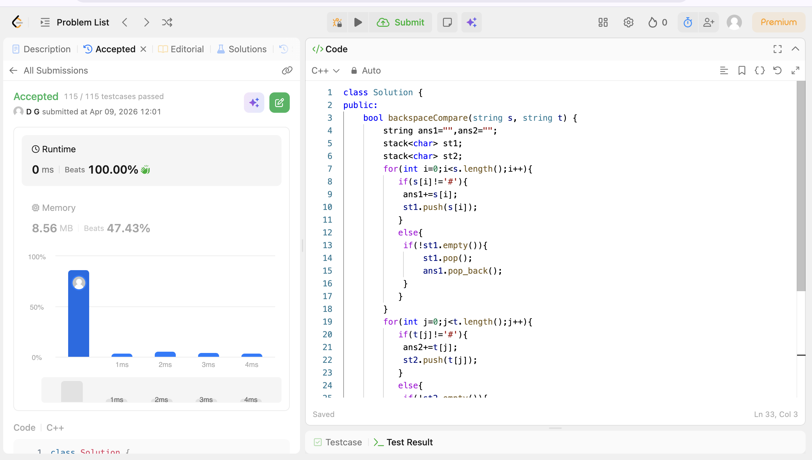

# CODE
class Solution {
public:
    bool backspaceCompare(string s, string t) {
        string ans1="",ans2="";
        stack<char> st1;
        stack<char> st2;
        for(int i=0;i<s.length();i++){
           if(s[i]!='#'){
            ans1+=s[i];
            st1.push(s[i]);
           }
           else{
            if(!st1.empty()){
                st1.pop();
                ans1.pop_back();
            }
           }
        }
        for(int j=0;j<t.length();j++){
           if(t[j]!='#'){
            ans2+=t[j];
            st2.push(t[j]);
           }
           else{
            if(!st2.empty()){
            st2.pop();
            ans2.pop_back();
            }
           }
        }
        return ans1==ans2;
    }
};

## Proof of Acceptance

